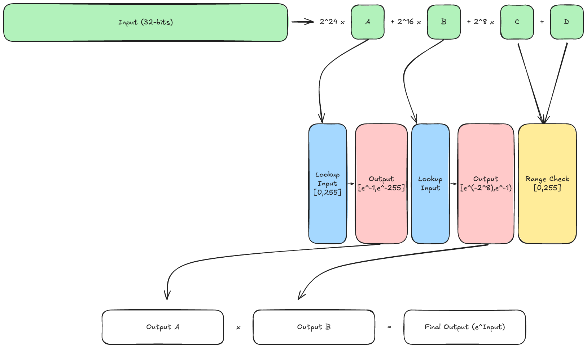

# Softmax

## Description of Layer

Formally Softmax is a linear operator that maps $`\mathbb{R}^{n}`$ to $`\mathcal{U}_{n}`$, where $`\mathcal{U}_{n}`$ is the space of probability distributions for discrete random variables with $`n`$ possible outcomes. Importantly for a vector $`v \in \mathbb{R}^{n}`$ it maps each component of $`v`$ to the interval $`(0,1)`$ and satisfies the sum of the components is $`1`$. The definition of the map is

$$ \begin{align*} \mathrm{Softmax}(v):& \mathbb{R}^{n}\rightarrow \mathcal{U}_{n} \\
&v \mapsto \left(\frac{\exp(v_{i})}{\sum_{j=1}^{n}\exp(v_{j})}\right)_{i=1}^{n}\end{align*} $$

The Softmax layer is used to inside a transformer to map a tensor of weighted values to a probability distribution. The QKV layer produces three tensors:
 
 - The query $` Q \in \mathbb{R}^{h}`$
 - The keys $` K \in \mathbb{R}^{s\times h}`$
 - The values $` V \in \mathbb{R}^{s \times h}`$

 where $` h`$ is the head dimension and $`s`$ is the sequence length. Softmax is employed on $`QK^{\intercal}\in \mathbb{R}^{s}`$, namely we calculate 

 $$ \begin{align*} \mathrm{Softmax}\left(\frac{QK^{\intercal}}{\sqrt{h}}\right) = \left(\frac{\exp(\frac{QK^{\intercal}_{i}}{\sqrt{h}})}{\sum_{j=1}^{s}\exp(\frac{QK^{\intercal}_{j}}{\sqrt{h}})}\right)_{i=1}^{s}.\end{align*} $$

 ### Shift Invariance

 One of the key properties of Softmax which we make use of to both stabilise inference and to assist with proving is that is invariant under shifts. That is given a vector $`v\in\mathbb{R}^{d}`$ and a constant vector $`\emph{c}\in\mathbb{R}^{d}`$ then 

 $$ \begin{align*}  \mathrm{Softmax}(v - c)_{i} &= \frac{\exp(v_{i}-c)}{\sum_{j=1}^{d}\exp(v_{j}-c)} \\ &=\frac{\exp(-c)\cdot\exp(v_{i})}{\exp(-c)\cdot\sum_{j=1}^{d}\exp(v_{j})}\\ &=\frac{\exp(v_{i})}{\sum_{j=1}^{d}\exp(v_{j})} \\ &= \mathrm{Softmax}(v)_{i}.\end{align*} $$

 ## Proving the Layer

 Due to the highly non-linear nature, and the fact that the $`\exp`$ function has no natural analogue over a finite field $`\mathbb{F}`$, we employ lookups to prove correct execution of softmax. The technique is largely based on that proposed in [zkLLM][1], the notable differences being due to Deep Proves use of the Goldilocks field we perform quantisation differently. 

  ### Exponential Tables

 In order to reuse lookup tables between softmax layers we assume that the scaling factor of the quantised inputs is the same everytime. For this we pick a suitable power of $`2`$ (in our case $`2^{24}`$) and consider our quantised values $`q`$ to be such that if $`x\in\mathbb{R}`$ then $`2^{24} \cdot x = q`$. 

 Additionally it is assumed that all inputs to the $`\exp`$ lookup are negative, this is to give better stability. This can always be achieved by subtracting a suitable constant before the lookup, and then multiplying the output by a suitable constant after.

 The scaling factor of $`2^{24}`$ means that we can treat inputs as $`32`$-bit numbers with $`8`$-integral bits and $`24`$-fractional bits. We then chunk our inputs into $`8`$-bit limbs, the two most significant are passed to tables that compute the exponential while the two least significant are range checked. The two least significant chunks do not have to bexponentiated as they represent values between $`-(2^{-8})`$ and $`-(2^{-24})`$ and the exponential of any number in this range is ~$`1`$.

 The below image demonstrates how this lookup works:

 

 ### Normalisation

 Proving the normalisation is tricky so rather than doing it explicitly for a vector $`z\in\mathbb{F}^{s}`$ we view it as an integer and dequantise entry-by-entry, via the formula $`\gamma \cdot z_{i} = x_{i}`$. This yields a vector $`x\in\mathbb{R}^{s}`$. Using this we compute

 $$ \hat{z} := \frac{\sqrt{s}}{\gamma}\ln\left(\sum_{j=1}^{s}\exp\left(\frac{x_{j}}{\sqrt{s}}\right)\right). $$

 We then compute $`X = z - \hat{z}`$ element-wise resulting in a vector of values that are all negative. We perform the $`\exp`$ lookup described above on $`X`$ to obtain $`Y`$. If the prover acts honestly then we have $`Y = \mathrm{Softmax}(z)`$. By the fact we used the $`\exp`$ lookup we know that $`Y`$ contains the exponentials of the elements of $`X`$. But $`X`$ was constructed in such a way that its entries should sum to $`1`$. We write $`\theta`$ for the scaling factor of $`Y`$, then observe:

 $$ \begin{align*} \exp\left(\frac{\gamma}{\sqrt{s}}\cdot(z_{i} - \hat{z})\right) &= \exp\left(\frac{\gamma}{\sqrt{s}}\cdot\left(z_{i}-\frac{\sqrt{s}}{\gamma}\ln\left(\sum_{j=1}^{s}\exp\left(\frac{x_{j}}{\sqrt{s}}\right)\right)\right)\right) \\ &= \exp\left(\frac{x_{i}}{\sqrt{s}}-\ln\left(\sum_{j=1}^{s}\exp\left(\frac{x_{j}}{\sqrt{s}}\right)\right)\right) \\ &=\frac{\exp\left(\frac{x_{i}}{\sqrt{s}}\right)}{\sum_{j=1}^{s}\exp\left(\frac{x_{j}}{\sqrt{s}}\right)} \\ &=\frac{1}{\theta}Y_{i}\end{align*} $$

 So if $`Y`$ has been computed correctly then its entries should sum to $`\frac{1}{\theta}`$. We choose our scaling factor $`\frac{1}{\theta}`$ to be $`2^{8}`$, hence we just have to check that the entries of $`Y`$ sum to $`256`$ plus or minus some error.

 ### Allowable Error
 
 Using the formula provided by [zkLLM][1] we can find a suitable bound for the error in normalisation. This error occurs due to rounding in quantisation which can mean the final sum does not always equal $`\frac{1}{\theta}`$. To prove we are in an acceptable range during setup an error bound is determined and we range check the difference between the sum of $`Y`$ and $`\frac{1}{\theta}`$ to be within this range.

 [1]: https://arxiv.org/pdf/2404.16109